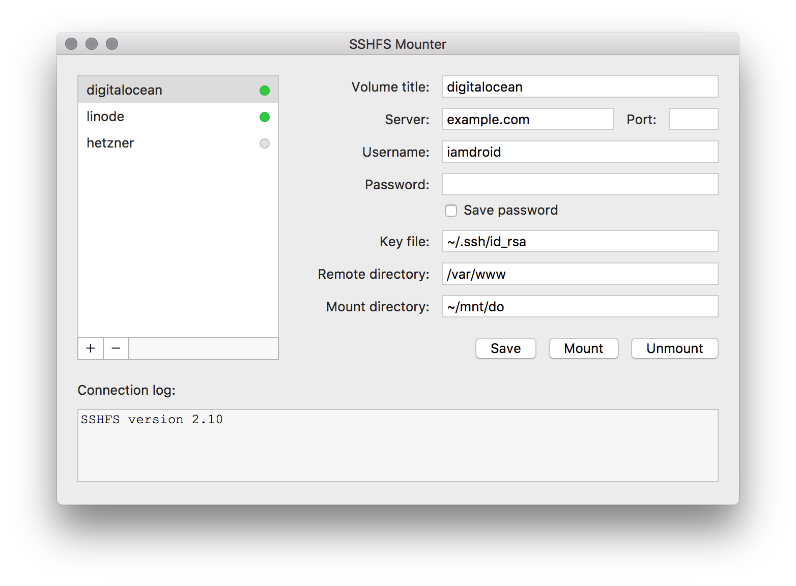

# SSHFS Mounter (Native)

A native macOS GUI application for mounting SSHFS volumes. This is a complete rework of the original [sshfs-mounter](https://github.com/i-amdroid/sshfs-mounter) app, rebuilt from the ground up using Swift/SwiftUI.



## Features

- **Native macOS app** - Built with Swift/SwiftUI, no Electron overhead
- **Tiny footprint** - Only 1.5MB vs 100MB+ for Electron-based alternatives
- **Dark & Light mode** - Automatically adapts to your system appearance
- **Multiple connections** - Store and manage multiple SSH profiles
- **Quick mount/unmount** - One-click mount and unmount operations
- **SSH key support** - Use password or SSH key authentication
- **Minimal resource usage** - Runs efficiently in the background

## Requirements

- **macOS 13.0 (Ventura) or later** - Also tested on macOS 26.x (Sequoia)
- **sshfs** - Required for mounting remote filesystems

## Installation

### 1. Install Dependencies

You need `sshfs` and a FUSE implementation. There are two options:

#### Option A: macFUSE (Traditional)
```bash
brew install --cask macfuse
brew install gromgit/fuse/sshfs-mac
```

#### Option B: FUSE-T (Recommended for macOS Sequoia)
If you're on macOS Sequoia and experience crashes (exit code 139), use FUSE-T instead:
```bash
brew uninstall --cask macfuse  # If installed
brew install --cask fuse-t
brew reinstall gromgit/fuse/sshfs-mac
```

**Why FUSE-T?** macOS Sequoia has compatibility issues with macFUSE due to API v2/v3 incompatibility. FUSE-T is a drop-in replacement that doesn't require kernel extensions.

### 2. Install SSHFS Mounter

1. Download the latest DMG from [Releases](https://github.com/Delitants/sshfs-mounter-native/releases)
2. Open the DMG file
3. Drag **SSHFS Mounter** to your **Applications** folder

## Usage

1. **Launch** SSHFS Mounter from Applications
2. **Add a connection** by clicking the **+** button
3. **Fill in the details:**
   - Volume title: A name for your mount
   - Server: SSH server address (IP or hostname)
   - Port: SSH port (default: 22)
   - Username: Your SSH username
   - Password or Key file: Authentication method
   - Remote dir: Path on the remote server
   - Mount dir: Local mount point (must exist)
4. **Click Save** to store the connection
5. **Click Mount** to mount the remote filesystem

### Connection Status

- **Green dot** = Mounted
- **Gray dot** = Not mounted

## Building from Source

### Requirements
- Xcode 15.0 or later
- macOS 13.0 or later

### Build Steps

```bash
# Clone the repository
git clone https://github.com/Delitants/sshfs-mounter-native.git
cd sshfs-mounter-native

# Open in Xcode
open "SSHFS Mounter.xcodeproj"

# Build and run (Cmd+R)
```

### Create Distribution DMG

```bash
# Build release
xcodebuild -project "SSHFS Mounter.xcodeproj" \
  -scheme "SSHFS Mounter" \
  -configuration Release \
  -arch arm64 -sdk macosx \
  -derivedDataPath build

# Create DMG
mkdir -p dmg_build
cp -R build/Build/Products/Release/SSHFS\ Mounter.app dmg_build/
ln -s /Applications dmg_build/Applications

hdiutil create -volname "SSHFS Mounter" \
  -srcfolder dmg_build \
  -ov -format UDZO \
  "SSHFS Mounter.dmg"
```

## Troubleshooting

### "sshfs not found" error
Make sure sshfs is installed and in your PATH:
```bash
which sshfs
# Should return: /opt/homebrew/bin/sshfs (Apple Silicon)
# Or: /usr/local/bin/sshfs (Intel)
```

### Mount crashes (exit code 139)
This is a known macOS Sequoia compatibility issue with macFUSE. Install FUSE-T:
```bash
brew uninstall --cask macfuse
brew install --cask fuse-t
brew reinstall gromgit/fuse/sshfs-mac
```

### Permission denied errors
Make sure the mount directory exists and you have write permissions:
```bash
mkdir -p /Volumes/test
chmod 755 /Volumes/test
```

## License

This project is provided as-is for educational purposes.

## Acknowledgments

- Original concept inspired by [sshfs-mounter](https://github.com/i-amdroid/sshfs-mounter)
- Built with [SwiftUI](https://developer.apple.com/xcode/swiftui/)
- Uses [sshfs-mac](https://github.com/gromgit/fuse-sshfs-mac) by gromgit
